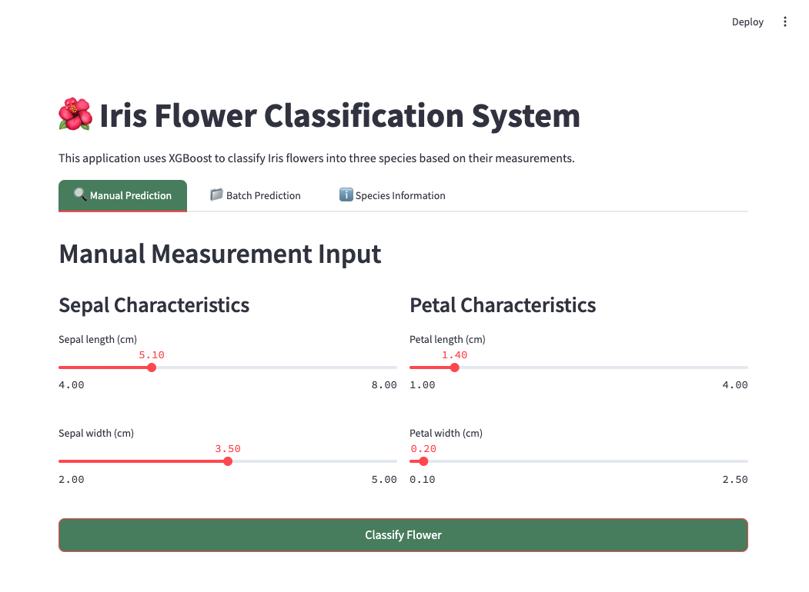
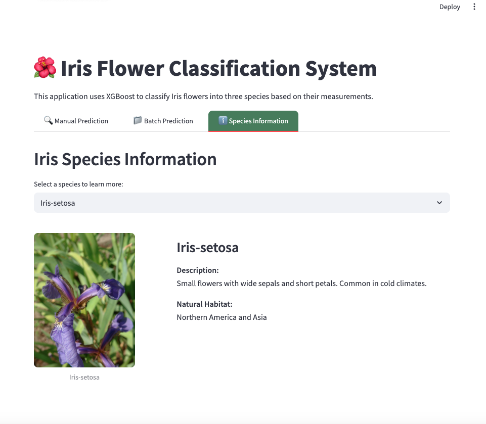
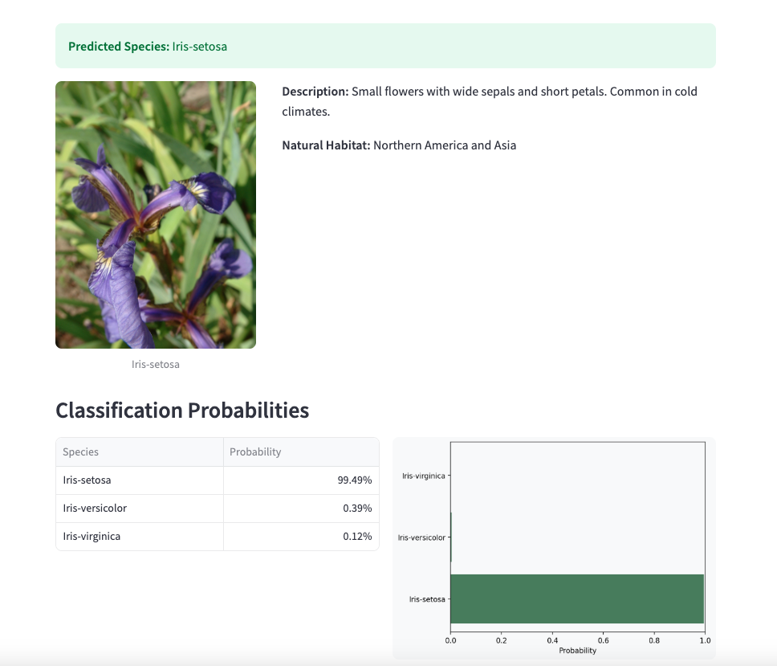
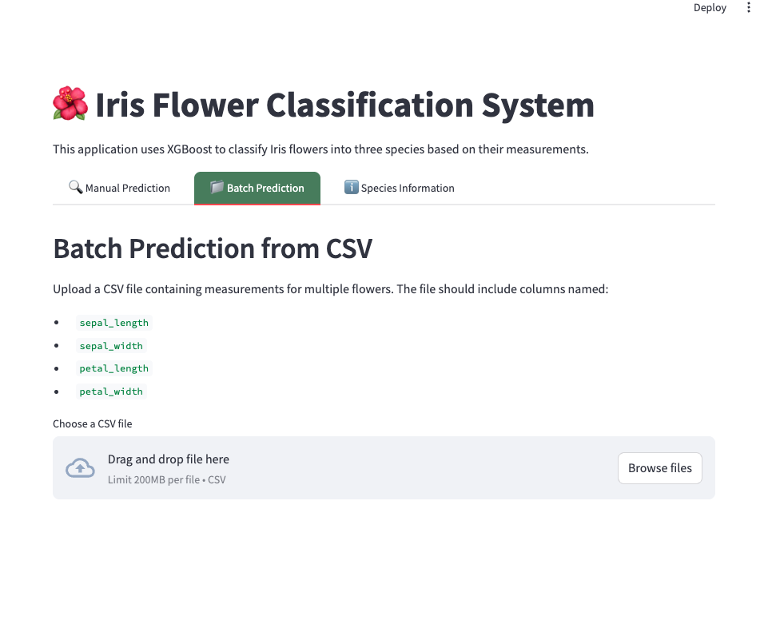

# 🌸 Iris Flower Classification System

**Sistema de clasificación de flores Iris usando XGBoost**  
*Professional ML web app built with Streamlit*

## 🌟 Features / Características
<div style="display: grid; grid-template-columns: repeat(2, 1fr); gap: 20px; margin: 20px 0;">     </div>
### **English Version**
- **Accurate Predictions**: XGBoost-powered classifier (94%+ accuracy)
- **Two Input Modes**:
  - Manual measurement input
  - Batch processing via CSV upload
- **Detailed Species Profiles**: Images and botanical information
- **Probability Visualization**: Clear confidence metrics
- **Export Results**: Download predictions as CSV

### **Versión en Español**
- **Predicciones precisas**: Modelo XGBoost (94%+ precisión)
- **Dos modos de entrada**:
  - Ingreso manual de medidas
  - Procesamiento por lotes con archivos CSV
- **Perfiles detallados**: Imágenes y datos botánicos
- **Visualización de probabilidades**: Métricas claras de confianza
- **Exportar resultados**: Descarga predicciones en CSV

## 🚀 Quick Start / Inicio Rápido

### Prerequisites / Requisitos
```bash
pip install streamlit pandas numpy matplotlib scikit-learn xgboost joblib pillow

streamlit run app.py

iris-classifier/
├── app.py                # Main application
├── xgb_modelo_iris_xgb.pkl  # Trained XGBoost model
├── label_encoder.pkl     # Label encoder
├── requirements.txt      # Dependencies
└── README.md            # This file

🛠 Technical Details / Detalles Técnicos
Model Performance:

Metric	Score
Accuracy	0.96
Precision	0.95
Recall	0.96

sepal_length,sepal_width,petal_length,petal_width
5.1,3.5,1.4,0.2
6.4,3.2,4.5,1.5

📸 Screenshots / Capturas
Manual Prediction
https://via.placeholder.com/400x250?text=Manual+Input

Batch Processing
https://via.placeholder.com/400x250?text=CSV+Upload


RL License - © 2025 [Rosana Longares]

🌐 Live Demo: [Coming Soon]
🐛 Report Issues: [GitHub Issues] vamos a mejorar este voy a añadir 4 fotos del streamlit